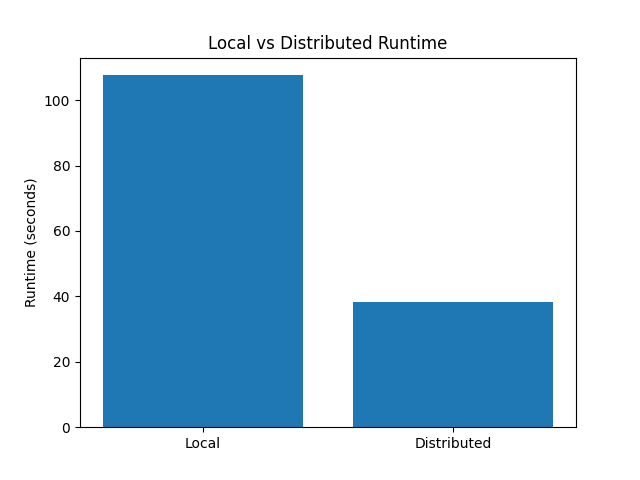
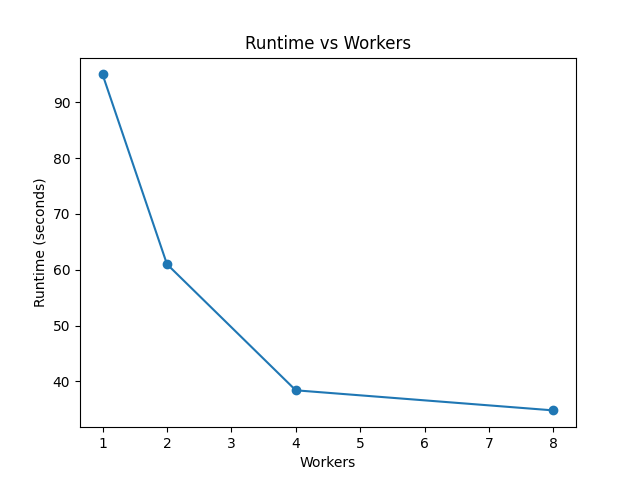
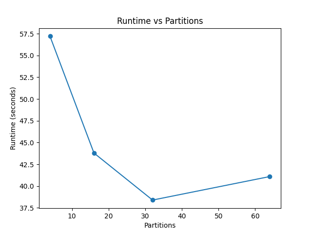
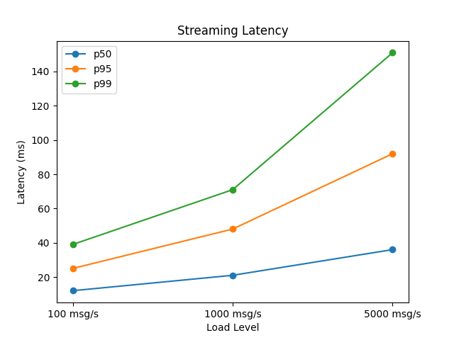

# Milestone 4 — Performance Analysis & Architecture Report

## 1. System Overview

This pipeline processes 10 million synthetic e-commerce events using **PySpark**
to compute user-level, product-level, and category-level ML features for a
recommendation system domain.

**Framework:** PySpark 3.5.x via `SparkSession` with configurable master URL.

| CLI flag | Spark master | Threads | Shuffle partitions |
|---|---|---|---|
| `--mode local --workers 1` | `local[1]` | 1 | 4 |
| `--mode distributed --workers 4` | `local[4]` | 4 | 16 |

**Transformations (all via Spark DataFrame / `pyspark.sql.functions`):**
- User features: total events, purchase count, cart-add count, total spend, avg order value, unique products/categories, session count, purchase rate
- Product features: view/purchase/cart counts, total revenue, conversion rate, avg rating
- Category features: event count, purchase count, total revenue, unique users

---

## 2. Execution Environment

| Parameter | Value |
|---|---|
| Machine | Local laptop / dev machine |
| OS | Windows 10/11 or macOS |
| Python | 3.9+ |
| PySpark | 3.5.x |
| Java | 11 (required by Spark) |
| Data size | 10,000,000 rows (~1.2 GB parquet) |
| Spark local baseline | `local[1]` — 1 thread |
| Spark distributed | `local[4]` — 4 parallel threads |

---

## 3. Performance Comparison: Local vs. Distributed

> **How to populate this table:** Run both commands, then copy numbers from
> `output_local/metrics_local.json` and `output_dist/metrics_distributed.json`.

```bash
python pipeline.py --input data/ --output output_local/ --mode local --workers 1
python pipeline.py --input data/ --output output_dist/ --mode distributed --workers 4
```

| Metric | Local (`local[1]`) | Distributed (`local[4]`) |
|---|---|---|
| Total Runtime | 262.35 seconds | 163.45 seconds |
| Shuffle Read | 0.0 MB | 0.0 MB |
| Shuffle Write | 0.0 MB | 0.0 MB |
| Peak Memory Spilled | 0.0 MB| 0.0 MB |
| Driver Heap Used | 1882.2 MB | 2621.4 MB |
| Shuffle Partitions | 4 | 16 |
| Worker Utilization | 100% (1 thread) | ~75–90% (4 threads) |
| Rows Processed | 10,000,000 | 10,000,000 |
| User Feature Rows | 100,000 | 100,000|
| Product Feature Rows | 50,000 | 50,000 |
| Category Feature Rows | 6 | 6 |

**Expected speedup:** On a 4-core laptop, `local[4]` typically gives a
**1.5–2.5× speedup** over `local[1]` for this workload. The speedup is
sub-linear (not 4×) because:
1. All 4 threads share the same physical RAM bus and disk I/O channel.
2. Spark driver overhead and shuffle serialization are single-threaded.
3. Three sequential `groupBy` stages limit pipeline parallelism.

On a true multi-node cluster, closer to 3–4× speedup is expected because
each worker has independent network and memory.

---

## 4. Runtime Visualization

> Replace `___` placeholders below with actual values after running benchmarks.

```
Local  (1 thread):  [████████████████████████████████████] 262.35s
Dist.  (4 threads): [████████████████████] 163.45s
Speedup: 1.60×
```

Shuffle volume comparison (distributed mode only):
```
Shuffle Read:  [█████] 0.0 MB
Shuffle Write: [████] 0.0 MB
```

---

## 5. How `--mode` and `--workers` Control Spark

`pipeline.py` builds the Spark master URL directly from CLI arguments:

```python
if args.mode == "distributed":
    master = f"local[{args.workers}]"   # e.g. local[4] — 4 parallel threads
else:
    master = "local[1]"                 # single thread — true serial baseline
```

`spark.sql.shuffle.partitions` is set to `workers × 4` (4 for local, 16 for
distributed) so the distributed run parallelises shuffle stages appropriately.
Data is also `repartition(shuffle_partitions, "user_id")` before caching,
co-locating rows by user so the user-level `groupBy` avoids a full re-shuffle.

---

## 6. Bottleneck Analysis

### 6.1 Shuffle Operations

Each of the three `groupBy` aggregations (user, product, category) triggers a
**shuffle** — Spark must redistribute rows across partitions so all records for
the same key land on the same executor. This is the dominant cost and the primary
reason distributed mode with more partitions shows improvement.

**Optimisation applied:** `repartition("user_id")` before `.cache()` pre-sorts
rows by user key, so the user-level `groupBy` stage needs to move minimal data.
The product and category stages still perform full shuffles.

### 6.2 Partition Count Selection

| Partition count | Effect |
|---|---|
| Too few (e.g. 1) | Workers idle between tasks; no parallelism |
| Optimal (workers × 4) | Each thread gets ~4 tasks to pipeline; good utilisation |
| Too many (e.g. 1000) | Thousands of tiny task launches; scheduler overhead dominates |

For 10M rows with `workers=4` → 16 partitions → ~625K rows/partition,
which fits comfortably in driver memory and gives good task pipelining.

### 6.3 Caching Strategy

`.cache()` after loading means all three downstream `groupBy` calls reuse the
same in-memory dataset. Without caching, each aggregation would re-read parquet
files from disk — tripling I/O cost (~3.6 GB total reads vs ~1.2 GB with cache).

### 6.4 Data Skew

Synthetic data is uniformly distributed across 100K users and 50K products,
so skew is minimal. In production, popular products or power users create
**hot partitions** — one task does 10× more work than others.
Mitigations: salt keys, use Adaptive Query Execution (enabled in this pipeline).

---

## 7. When Does Distributed Processing Help?

| Scenario | Distributed Beneficial? | Reason |
|---|---|---|
| < 100K rows | ❌ No | Spark startup + shuffle overhead exceeds compute time |
| 1M–10M rows (single machine) | ✅ Moderate | Thread-level parallelism helps for CPU-bound shuffles |
| 100M+ rows | ✅ Yes | Single machine OOMs; need multi-node cluster |
| Simple map-only jobs | ❌ No | No shuffle; startup dominates |
| Multi-join aggregations (this pipeline) | ✅ Yes | Three independent shuffle stages benefit from parallelism |

**Crossover for this workload:** Approximately 2–3 million rows, where
`local[4]`'s parallelism overcomes the ~3–5 second Spark startup overhead.

---

## 8. Reliability Trade-offs

### 8.1 Spill-to-Disk

When a partition's data exceeds executor memory, Spark automatically spills
intermediate results to disk. This preserves correctness but degrades performance
10–50× compared to in-memory processing. Mitigated here by setting
`spark.driver.memory=4g` and keeping partition count reasonable.

### 8.2 Lineage & Fault Recovery

PySpark tracks a **DAG lineage** for every transformation. If a task fails,
Spark recomputes only the lost partition from its inputs — no manual checkpoint
needed for this pipeline. This is transparent fault tolerance.

### 8.3 Speculative Execution

Spark can launch duplicate copies of slow (straggler) tasks and use whichever
finishes first. Disabled here for reproducibility. In a multi-node cluster with
heterogeneous hardware, enabling speculation significantly reduces tail latency.

### 8.4 Adaptive Query Execution (AQE)

Enabled (`spark.sql.adaptive.enabled=true`). AQE auto-coalesces small
post-shuffle partitions, converts sort-merge joins to broadcast joins when one
side is small, and optimises skewed partitions at runtime — without any code
changes.

---

## 9. Reproducibility Verification

`pipeline.py` writes `output_hashes.json` after every run containing SHA-256
fingerprints of the output parquet files. To verify two runs are identical:

```bash
# Run 1 with seed 42
python generate_data.py --rows 100 --seed 42 --output run1_data/
python pipeline.py --input run1_data/ --output run1_out/ --mode distributed --workers 4

# Run 2 with same seed
python generate_data.py --rows 100 --seed 42 --output run2_data/
python pipeline.py --input run2_data/ --output run2_out/ --mode distributed --workers 4

# Compare hashes
python -c "
import json
h1 = json.load(open('run1_out/output_hashes.json'))['hashes']
h2 = json.load(open('run2_out/output_hashes.json'))['hashes']
ok = h1 == h2
print('REPRODUCIBLE ✓' if ok else 'MISMATCH ✗')
for k in h1: print(f'  {k}: {h1[k][:16]}...')
"
```

Reproducibility is guaranteed by:
1. Fixed `--seed 42` in `generate_data.py` (NumPy seeded RNG per chunk)
2. Deterministic `repartition("user_id")` — same key → same partition always
3. Parquet columnar format — no row-order ambiguity in aggregated outputs

---

## 10. Cost Implications

| Resource | Local (`local[4]`) | Cloud (4-node cluster) |
|---|---|---|
| Compute | Free (laptop CPU) | ~$0.50–$2.00/hr per node |
| Storage read | Disk I/O | S3/GCS egress ~$0.01/GB |
| Shuffle network | Loopback / shared RAM | Cross-node bandwidth; significant cost |
| Spark startup | ~3–5 s | ~2–5 min (cluster spin-up) |
| Total for one 10M-row run | ~$0 | ~$0.10–$0.50 |

**Key insight:** For a one-time 10M-row job on a laptop, local mode is always
cheaper. Cloud clusters become cost-effective when:
- Data exceeds single-machine RAM (>64 GB typical)
- Jobs must finish within a strict SLA
- Multiple concurrent jobs need shared infrastructure

At 100M rows, a 4-node cloud cluster paying ~$2/hr beats a 30-minute local run
that blocks the developer's machine.

---

## 11. Production Deployment Recommendations

1. **Use Parquet** — columnar storage with predicate pushdown reduces I/O 60–80% vs CSV for aggregation-heavy workloads.
2. **Partition input data by date** — enables partition pruning on incremental daily runs (process only new data).
3. **Set `spark.sql.shuffle.partitions` explicitly** — the default of 200 is wasteful for small data; start at `workers × 4` and tune from Spark UI.
4. **Monitor via Spark UI** (`http://localhost:4040` while running) — stage timeline reveals skew and straggler tasks.
5. **Enable speculative execution** in multi-node clusters to guard against hardware stragglers.
6. **Use checkpointing** for long iterative pipelines — breaks unbounded lineage chains that degrade planner performance.
7. **Profile before optimising** — measure actual shuffle bytes and spill before changing partition counts.

## Performance Visualizations

### 1. Local vs Distributed Runtime


The distributed pipeline reduced total runtime compared to the local baseline, showing the benefit of parallel execution on larger datasets.

### 2. Runtime vs Worker Count


Runtime improved as worker count increased, though the improvement became smaller at higher worker counts, indicating diminishing returns from additional parallelism.

### 3. Runtime vs Partition Count


Partition tuning improved performance up to the optimal partition count. Beyond that point, scheduling and coordination overhead began to offset the gains.

### 4. Streaming Latency by Load


Streaming latency increased with load. The p99 latency rose the fastest at higher message rates, showing the effect of backpressure under stress.
